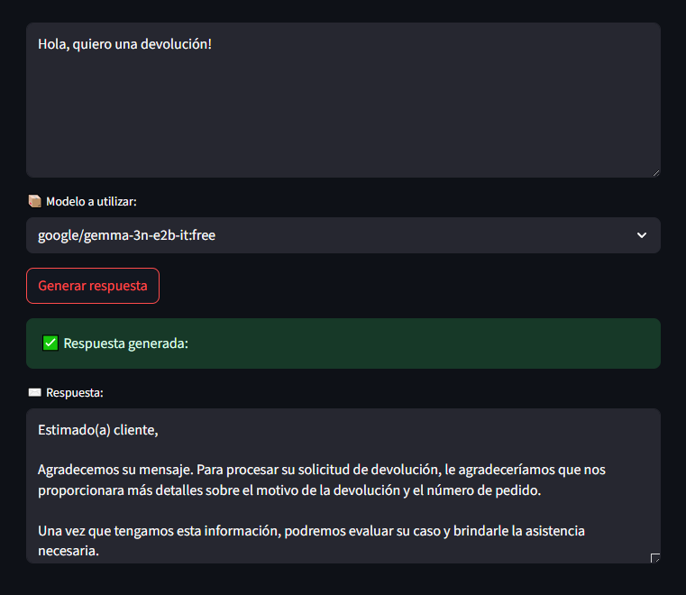
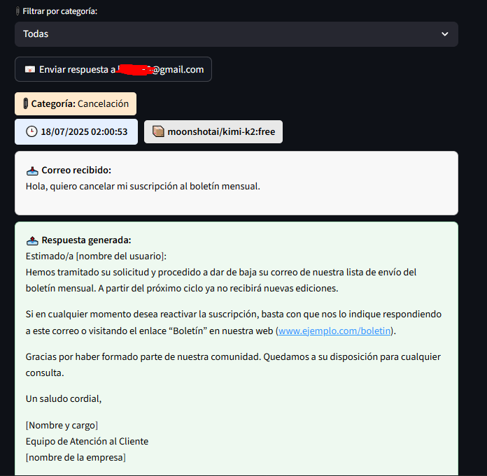
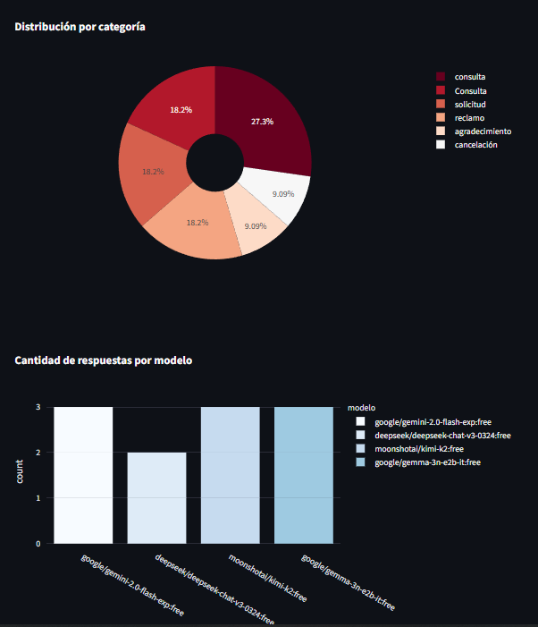
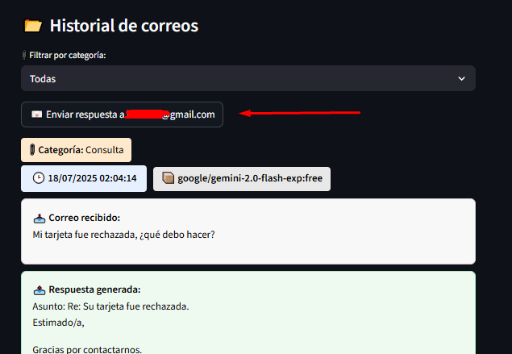
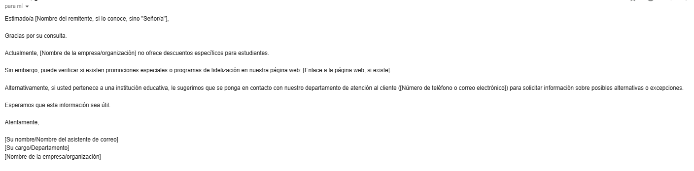

# 📬 Email GPT Assistant

Email GPT Assistant is an AI-powered application that generates and sends smart, context-aware email replies using large language models (LLMs) like Gemini, DeepSeek, and Moonshot via the OpenRouter API.

The app automatically classifies incoming messages, crafts personalized responses through dynamic prompt generation, and visualizes usage stats with Plotly — all within an intuitive Streamlit-based interface.

## 🧠 Features

- Automatic classification of emails by category.
- Personalized replies using multiple models (OpenRouter).
- Visual history of received and sent emails.
- Interactive statistics with Plotly.
- One-click email sending from the interface.

## 🚀 Technologies Used
- 🧠 FastAPI (Backend API)
- 🎨 Streamlit (Web Interface)
- ✉️ OpenRouter API (Gemini, DeepSeek, Moonshot, etc.)
- 📬 SMTP (Email Sending)
- 📊 Plotly (Data Visualization)
- 📝 Python 3.10+

## 📁 Project Structure

```
email_gpt_assistant/
├── AI_utils.py
├── app.py
├── logger.py
├── log.json
├── main.py
├── send_email.py
├── test_demo.py
├── requirements.txt
└── .env
```

## 🛠️ Installation

```bash
git clone https://github.com/youruser/email_gpt_assistant.git
cd email_gpt_assistant
python -m venv venv
source venv/bin/activate  # On Windows: venv\Scripts\activate
pip install -r requirements.txt
```

## ⚙️ Environment Setup

Create a `.env` file with your keys:

```env
OPENROUTER_API_KEY=sk-xxxxxx
EMAIL_USER=youremail@example.com
EMAIL_PASS=your_app_password
EMAIL_OWNER=testemail@example.com
```

## ▶️ Running the App

Start the FastAPI backend:

```bash
uvicorn main:app --reload
```

Then start the Streamlit frontend:

```bash
streamlit run app.py
```


## 📸 Screenshots

### 📥 Automated AI reply 


### 🤖 Filter and email LOG


### 📊 Interactive Stats Dashboard


### 📤 One-Click Send Interface




## 📂 License

Private use only. Do not redistribute without author permission.
